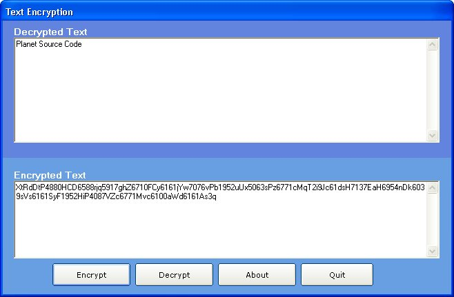



## Dynamic Encryption

### Description

Dynamic Encryption.

It's more like a character masking. You can encrypt the same text as many ties as you want and you will always receive a different result, however, if you decrypt it, it will always get the right result.

It was primary desiggned for automated systems to send and receive encrypted information and decrypt it without user intervention.
 
### More Info
 
Encrypted / Decrypted string.

You can not alter the encrypted text. If you do and try to decrypt it, you will receive an error message.

You can not decrypt more than one encrypted string at the same time.

             |
---                |---
**Submitted On**   |2005-10-23 09:48:12
**By**             |[Kelvin C\. Perez \- Valentin](https://github.com/Planet-Source-Code/PSCIndex/blob/master/ByAuthor/kelvin-c-perez-valentin.md)
**Level**          |Intermediate
**User Rating**    |4.9 (34 globes from 7 users)
**Compatibility**  |VB 6\.0
**Category**       |[Encryption](https://github.com/Planet-Source-Code/PSCIndex/blob/master/ByCategory/encryption__1-48.md)
**World**          |[Visual Basic](https://github.com/Planet-Source-Code/PSCIndex/blob/master/ByWorld/visual-basic.md)
**Archive File**   |[Dynamic\_En19426710232005\.zip](https://github.com/Planet-Source-Code/kelvin-c-perez-valentin-dynamic-encryption__1-62999/archive/master.zip)

